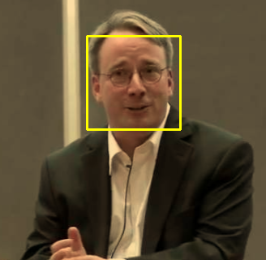

# face_recognition
face_recognition, a popular tool in many applications, we used now is based on ArcFace created by [ArcSoft](https://www.arcsoft.com.cn/).  What we did here is to finish a offline face_recognition TOOL, which can detecte and recognize the targets designated by you without any changes and modification in CODE and "TRAIN". 

# Getting Started
- OpenCV 3 +
- Arcface 2.1 +
- Visual Studio 2017
- [Jsoncpp](https://github.com/open-source-parsers/jsoncpp)

# Compiling from source
- Add `OPENCV` and `ARCFACE` into environment, which will be used in `.vcxproj`:
  - `OPENCV : ...\opencv\opencv\build`
  - `ARCFACE: ...\arcface\v2.1`
- Open `face_module.sln`

By the way, maybe you need to change the name of lib of OpenCV because the version we included is different(OpenCV346 on my platform). To avoid this problem, I suggest you install the same version of OpenCV.

# Usage
1. Add target images
    - add images into `preload/`(only one person contains is best)
    - change your *image's name* into *number.jpg/png*(such as 3.jpg or 4.png)
    - Like:
    ```
    // ...
    07/01/2019  08:31 PM            15,953 5.jpg
    ```
    - In this chapter, I put that guy's image into my preload directory which named "5.jpg":
    - 
  
2. Add target info
    -  add info about that MAN in json pattern into `peopleInfo.json`(Do not change this name):
    ``` Json
    {
        "5" : {
            "id": "42",
            "name":"Linus Benedict Torvalds",
            "major":"F*k NVIDIA"
        }
    }
    ```
3. Run 
    - Put image that you want to detecte into `sample/`, just like this `sample/test1_Exist.png`

    ``` C++
    cv::Mat frame = cv::imread("sample/test1_Exist.png");
	//cv::Mat frame = cv::imread("sample/aGroupofPeople_NotExist.png");
	facedete.DetectFaces(frame, detectedResult);

	int totalFaceNum = detectedResult.size();
	for (int i = 0; i < totalFaceNum; i++) {
		currFace = detectedResult[std::to_string(i)];

		for (int j = 0; j < 4; j++) {
			faceRect[j] = currFace["rect"][j].asInt();
		}
		facedete.DrawRetangle(frame, faceRect);
		cout << "------------------------" << endl;
		cout << "[identifiable]" << currFace["identifiable"] << endl;
		cout << "[currFace]" << currFace["rect"] << endl;
		cout << "[id]" << currFace["id"] << endl;
		cout << "[name]" << currFace["name"] << endl;
		cout << "[major]" << currFace["major"] << endl;
		cout << "[confidence]" << currFace["confidence"] << endl;
		cout << "[pathInPreload]" << currFace["pathInPreload"] << endl;
		cout << "[age]" << currFace["age"] << endl;
		cout << "[gender]" << currFace["gender"] << endl;
		cout << "[liveinfo]" << currFace["liveinfo"] << endl;
	}
	cv::imshow("show", frame);
	cv::waitKey(0);
	detectedResult.clear();
    ```
    - Result: 
    ``` 
    ...
    [identifiable]true
    [currFace][
            107,
            44,
            223,
            160
    ]
    [id]null
    [name]null
    [major]null
    [confidence]0.81119471788406372
    [pathInPreload]"preload\\5.jpg"
    [age]52
    [gender]0
    [liveinfo]1
    ...
    ```
    

4. These macro[s] are important.
    ``` C++
    #define FACEDEBUG 
    #define OTHERINFO
    ```